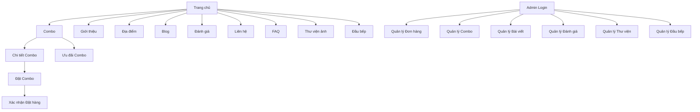

# Tài liệu Yêu cầu Sản phẩm - Website Gà Nướng GANU

## 1. Tổng quan Sản phẩm

Website gà nướng GANU là nền tảng thương mại điện tử chuyên về combo gà nướng với giao diện hiện đại, thân thiện với mobile. Hệ thống bao gồm frontend cho khách hàng và backend quản trị toàn diện.

* Giải quyết nhu cầu đặt hàng online tiện lợi, quản lý đơn hàng hiệu quả và xây dựng thương hiệu mạnh mẽ.

* Mục tiêu trở thành nền tảng gà nướng hàng đầu với trải nghiệm khách hàng xuất sắc.

## 2. Tính năng Cốt lõi

### 2.1 Vai trò Người dùng

| Vai trò       | Phương thức Đăng ký | Quyền Cốt lõi                                |
| ------------- | ------------------- | -------------------------------------------- |
| Khách hàng    | Truy cập trực tiếp  | Xem combo, đặt hàng, đánh giá, liên hệ       |
| Quản trị viên | Được cấp tài khoản  | Quản lý toàn bộ hệ thống, đơn hàng, nội dung |

### 2.2 Module Tính năng

Website GANU bao gồm các trang chính sau:

1. **Trang chủ**: banner tự động, giới thiệu thương hiệu, combo nổi bật, ưu đãi, đánh giá khách hàng, liên kết nhanh
2. **Giới thiệu**: câu chuyện thương hiệu, video, hành trình phát triển, tầm nhìn sứ mệnh
3. **Địa điểm**: danh sách chi nhánh, Google Maps, giờ mở cửa, hotline
4. **Combo**: danh sách combo với hình ảnh, mô tả, giá, nút chi tiết và đặt hàng
5. **Chi tiết Combo**: ảnh cận cảnh, thành phần, đánh giá khách hàng
6. **Đặt hàng**: form đặt hàng với thông tin khách hàng và lựa chọn combo
7. **Admin Panel**: quản lý đơn hàng, combo, bài viết, đánh giá, thư viện ảnh

### 2.3 Chi tiết Trang

| Tên Trang                | Tên Module             | Mô tả Tính năng                                                  |
| ------------------------ | ---------------------- | ---------------------------------------------------------------- |
| Trang chủ                | Banner tự động         | Hiển thị ảnh món gà và slogan, tự động lướt ngang như ooo.com.vn |
| Trang chủ                | Combo nổi bật          | Hiển thị combo đặc biệt trong ngày với ảnh và giá                |
| Trang chủ                | Ưu đãi hiện tại        | Hiển thị các khuyến mãi đang áp dụng                             |
| Trang chủ                | Đánh giá mới nhất      | Hiển thị feedback và rating từ khách hàng                        |
| Trang chủ                | Liên kết nhanh         | Nút đặt hàng, xem combo, ưu đãi                                  |
| Giới thiệu               | Câu chuyện thương hiệu | Hiển thị nội dung text về GANU                                   |
| Giới thiệu               | Video giới thiệu       | Nhúng video thương hiệu                                          |
| Giới thiệu               | Hành trình phát triển  | Timeline phát triển công ty                                      |
| Giới thiệu               | Tầm nhìn sứ mệnh       | Hiển thị giá trị cốt lõi                                         |
| Địa điểm                 | Danh sách chi nhánh    | Hiển thị thông tin các điểm bán                                  |
| Địa điểm                 | Google Maps            | Nhúng bản đồ với vị trí chi nhánh                                |
| Địa điểm                 | Thông tin liên hệ      | Giờ mở cửa, hotline từng điểm                                    |
| Combo                    | Danh sách combo        | Grid layout hiển thị combo với ảnh, tên, giá                     |
| Combo                    | Nút hành động          | Nút "Chi tiết" và "Đặt Combo" cho mỗi item                       |
| Ưu đãi Combo             | Danh sách khuyến mãi   | Hiển thị các ưu đãi với thời gian và điều kiện                   |
| Chi tiết Combo           | Ảnh cận cảnh           | Gallery ảnh món ăn chất lượng cao                                |
| Chi tiết Combo           | Thông tin chi tiết     | Thành phần, khẩu phần, gợi ý cách ăn                             |
| Chi tiết Combo           | Đánh giá khách hàng    | Hiển thị review và rating                                        |
| Đặt Combo                | Form đặt hàng          | Thu thập tên, SĐT, địa chỉ, ghi chú                              |
| Đặt Combo                | Chọn combo             | Dropdown chọn combo và số lượng                                  |
| Đặt Combo                | Xử lý đơn hàng         | Validate và gửi đơn hàng                                         |
| Xác nhận đặt hàng        | Mã đơn hàng            | Hiển thị order ID duy nhất                                       |
| Xác nhận đặt hàng        | Tóm tắt đơn            | Chi tiết combo, số lượng, tổng tiền                              |
| Xác nhận đặt hàng        | Gửi xác nhận           | Email/SMS thông báo (tùy chọn)                                   |
| Đầu bếp                  | Hồ sơ chef             | Hiển thị 4 đầu bếp chính với ảnh, tên, kinh nghiệm               |
| Thư viện ảnh             | Tự động lưu ảnh        | Backup ảnh từ đánh giá, blog, combo                              |
| Thư viện ảnh             | Phân loại tag          | Categorize theo khách chụp, món ăn, sự kiện                      |
| Thư viện ảnh             | Tìm kiếm               | Search theo từ khóa                                              |
| Trang đơn                | Nội dung tĩnh          | Hiển thị chính sách, điều khoản                                  |
| FAQ                      | Câu hỏi thường gặp     | Accordion Q\&A theo nhóm đặt hàng, thanh toán                    |
| Đánh giá                 | Rating system          | Cho phép đánh giá 1-5 sao                                        |
| Đánh giá                 | Upload media           | Cho phép upload ảnh/video                                        |
| Đánh giá                 | Hiển thị công khai     | Show review đã duyệt                                             |
| Liên hệ                  | Form liên hệ           | Thu thập họ tên, email, nội dung                                 |
| Liên hệ                  | Thông tin liên hệ      | Bản đồ, hotline, fanpage, Zalo                                   |
| Blog                     | Đăng bài viết          | Chia sẻ mẹo vặt, cách chế biến                                   |
| Blog                     | Tìm kiếm phân loại     | Search và category bài viết                                      |
| Admin - Đăng nhập        | Xác thực admin         | Form login chỉ cho admin                                         |
| Admin - Quản lý đơn hàng | Danh sách đơn          | Lọc theo thời gian, trạng thái, chi nhánh                        |
| Admin - Quản lý đơn hàng | Cập nhật trạng thái    | Xác nhận giao hàng, duyệt đơn                                    |
| Admin - Quản lý bài viết | Trình soạn thảo        | Rich text editor với format đầy đủ                               |
| Admin - Quản lý bài viết | Upload media           | Thêm ảnh, video trực tiếp                                        |
| Admin - Quản lý bài viết | Quản lý trạng thái     | Draft và published posts                                         |
| Admin - Quản lý combo    | CRUD combo             | Thêm/sửa/xóa combo                                               |
| Admin - Quản lý combo    | Thiết lập giá          | Đặt giá, ảnh, mô tả, ưu đãi                                      |
| Admin - Quản lý đánh giá | Duyệt review           | Xem và approve bình luận, media                                  |
| Admin - Quản lý đánh giá | Gắn combo              | Link review với combo tương ứng                                  |
| Admin - Thư viện ảnh     | Quản lý media          | Phân loại, lọc, xóa, thêm tag                                    |
| Admin - Quản lý đầu bếp  | CRUD chef              | Thêm/sửa/xóa thông tin đầu bếp                                   |
| Admin - Quản lý FAQ      | CRUD FAQ               | Thêm/sửa câu hỏi, sắp xếp nhóm                                   |

## 3. Quy trình Cốt lõi

**Quy trình Khách hàng:**
Khách hàng truy cập trang chủ → Xem combo → Chi tiết combo → Đặt hàng → Xác nhận đơn → Nhận email/SMS → Đánh giá sau khi sử dụng

**Quy trình Admin:**
Admin đăng nhập → Quản lý combo/bài viết → Xử lý đơn hàng → Duyệt đánh giá → Cập nhật nội dung

## 4. Thiết kế Giao diện Người dùng

### 4.1 Phong cách Thiết kế

* **Màu sắc chính**: Cam nướng (#FF6B35), Vàng ấm (#FFD23F)

* **Màu sắc phụ**: Nâu gỗ (#8B4513), Trắng (#FFFFFF), Xám nhạt (#F5F5F5)

* **Kiểu nút**: Bo tròn với hiệu ứng hover, shadow nhẹ

* **Font chữ**: Roboto cho tiêu đề (16-24px), Open Sans cho nội dung (14-16px)

* **Layout**: Card-based design, navigation top, sticky header

* **Icon**: Material Design icons, emoji thực phẩm 🍗🔥✨

### 4.2 Tổng quan Thiết kế Trang

| Tên Trang      | Tên Module    | Thành phần UI                                                 |
| -------------- | ------------- | ------------------------------------------------------------- |
| Trang chủ      | Banner        | Carousel slider với animation fade, overlay text, CTA buttons |
| Trang chủ      | Combo nổi bật | Card grid 3 cột, hover effects, price tags                    |
| Combo          | Danh sách     | Masonry layout, filter buttons, pagination                    |
| Chi tiết Combo | Gallery       | Lightbox modal, thumbnail navigation                          |
| Đặt hàng       | Form          | Multi-step wizard, validation messages, progress indicator    |
| Admin Panel    | Dashboard     | Sidebar navigation, data tables, charts, modal dialogs        |
| Blog           | Bài viết      | Magazine layout, featured images, tag clouds                  |
| Đánh giá       | Rating        | Star rating component, image upload preview                   |

### 4.3 Tính năng Responsive

Website được thiết kế mobile-first với breakpoints:

* Mobile: 320px-768px (1 cột)

* Tablet: 768px-1024px (2 cột)

* Desktop: 1024px+ (3-4 cột)
  Tối ưu hóa touch interaction cho mobile với button size tối thiểu 44px.

